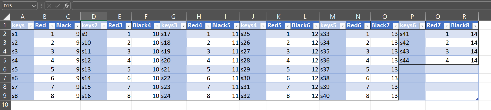

# MIDI Keyboard using a MicroController

Developing a MIDI keyboard using a microcontroller, enabling real-time musical note transmission to DAWs via MIDI protocols. The project includes key matrix scanning, shift register integration, and USB-MIDI communication.

## Components Used
- Arduino Uno (input src USB)
- 74hc595 Shift Register
- Resistors(10k)
- Jumper wires
- Breadboard

## Circuit Diagram

## Installation Instructions
1. Install the Arduino IDE.
2. Clone this repository.
3. Open the `.ino` file in the Arduino IDE.
4. Reassign the pins according to the Key Matrix of the Keys.
5. Install and run the LoopMIDI and HairlessMIDI software.
6. Upload the code to your Arduino Uno.

## Usage Instructions
* Set the Multimeter to Continuity Mode

>Turn on the multimeter and select the "Continuity" range (often indicated by a soundwave or diode symbol).
Identify Key Connections

>Press a key on the synthesizer and check which pins on the key matrix produce a response on the multimeter (usually a beep or a displayed value).
Map the Keys

>Systematically press each key on the synthesizer and document which rows and columns are connected for each key.

>Create a matrix (like a table) to visualize and organize the connections, noting which row and column correspond to each key.

* Connect the Arduino Uno, Shift Register pins, and Synthesizer keys as per the circuit diagram.

>Refer to the circuit diagram to ensure proper connections between the Arduino Uno, Shift Register (e.g., 74HC595), and the Synthesizer key matrix.

>Connect the power (5V) and ground (GND) lines to the respective components.

>Connect the data (DS), shift clock (SH_CP), and latch clock (ST_CP) pins of the shift register to the corresponding digital pins on the Arduino.

>Connect the output pins of the shift register to the rows of the key matrix and link the columns of the key matrix to the Arduino’s input pins.

* Connect the Arduino to your system and select "Arduino MIDI" in Hairless MIDI Control and LoopMIDI.

>Use a USB cable to connect the Arduino to your computer.

>Open LoopMIDI and create a virtual MIDI port (if not already done).

>Launch Hairless MIDI and select "Arduino MIDI" as the input device.

>Ensure that the virtual MIDI port from LoopMIDI is selected as the output device in Hairless MIDI.

* Play the MIDI keyboard using the DAW.

>Open your Digital Audio Workstation (DAW) (like FL Studio, Ableton Live, Logic Pro, etc.).

>Configure the DAW to recognize the virtual MIDI port from LoopMIDI as an input.

>Load a virtual instrument or synthesizer plugin.

>Play the keys on your connected MIDI keyboard, and you should hear sounds from the DAW, with each key press corresponding to a note.

## References
YoutubeReference: https://youtu.be/qVPsnqUbu6M?feature=shared

ShiftRegister Doc: https://docs.arduino.cc/tutorials/communication/guide-to-shift-out/

HairLess MidiControl: https://www.softpedia.com/get/Multimedia/Audio/Other-AUDIO-Tools/MIDIControl.shtml

LoopMidi: https://loopmidi.software.informer.com/1.0/

## 

