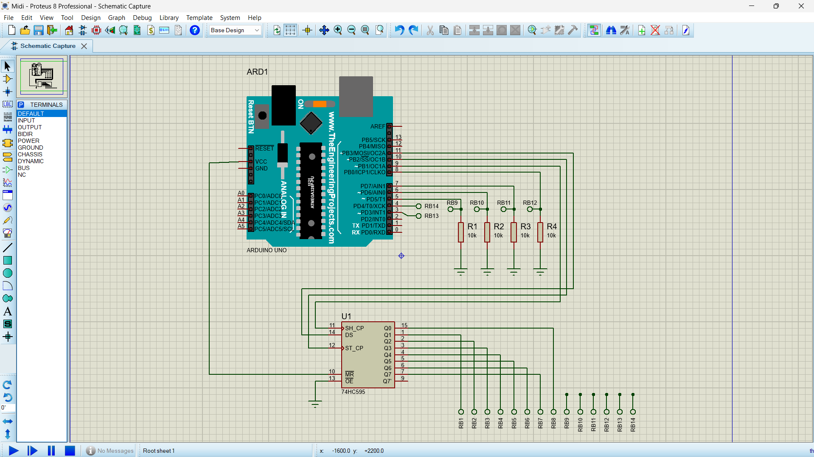
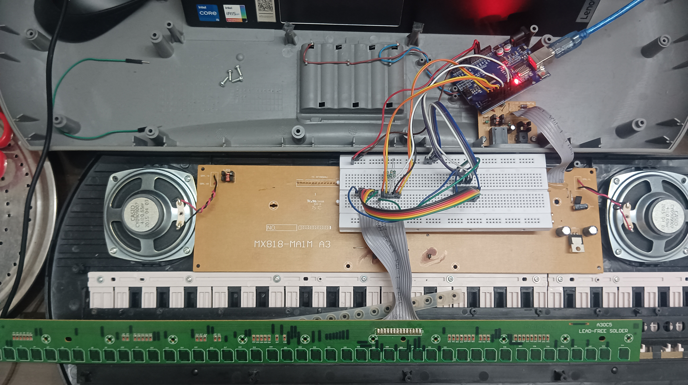
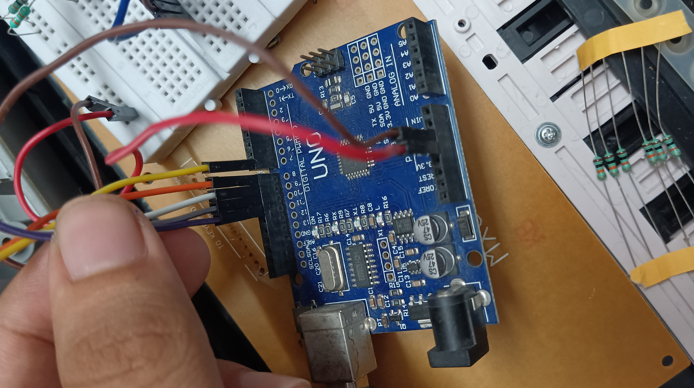

# MIDI Keyboard using a MicroController

This project demonstrates how to convert a toy synthesizer into a MIDI keyboard using an Arduino Uno, allowing for MIDI output to control digital audio workstations.

## Components Used
- Arduino Uno (input src USB)
- 74hc595 Shift Register
- Resistors(10k)
- Jumper wires
- Breadboard

## Circuit Diagram

## Installation Instructions
1. Install the Arduino IDE.
2. Clone this repository.
3. Open the `.ino` file in the Arduino IDE.
4. Reassign the pins according to the Key Matrix of the Keys.
5. Install and run the LoopMIDI and HairlessMIDI software.
6. Upload the code to your Arduino Uno.

## Usage Instructions
1. Figure out the scan Marix of the synthiser with the help of Multimeter.
2. Connect the ArduinoUno, ShirftRegister Pins and Synthesiser Keys according to the Circuit diagram.
3. Connect the Arduino with your system and Select the Ardino MIDI in hairlessMIDI Control and LoopMIDI.
4. Play the MIDI keyboard with the DAW

## References
YoutubeReference: https://youtu.be/qVPsnqUbu6M?feature=shared

ShiftRegister Doc: https://docs.arduino.cc/tutorials/communication/guide-to-shift-out/

HairLess MidiControl: https://www.softpedia.com/get/Multimedia/Audio/Other-AUDIO-Tools/MIDIControl.shtml

LoopMidi: https://loopmidi.software.informer.com/1.0/

## 

